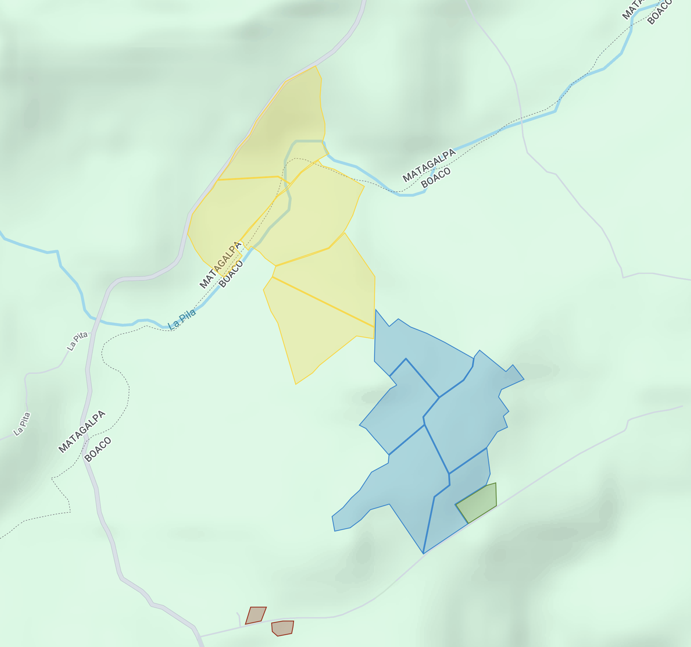

# Plano de la Finca y Distribución de Potreros

## Índice de Navegación

- [Inicio](./README.md)
- [Información General](./01_InformacionGeneral.md)
- [Inventario de Ganado](./inventario_ganado.md)
- [Diagnóstico Actual](./02_DiagnosticoActual.md)
- [Plan de Mejora](./03_PlanDeMejora.md)
- [Cronograma de Implementación](./04_CronogramaImplementacion.md)
- [Presupuesto](./05_Presupuesto.md)
- [Recursos y Referencias](./06_RecursosReferencias.md)

---

## Plano General

*Nota: La imagen del plano debe ser guardada en la carpeta "imagenes" del proyecto.*

## Leyenda del Plano
- **Zona Amarilla**: Área destinada al ganado horro
- **Zona Celeste**: Área destinada al ganado parido
- **Zona Terracota**: Área destinada a terneros, casa hacienda y corrales de ordeño

## Detalle de Potreros por Categoría

### Potreros para Ganado Horro (5 potreros)

| Nombre del Potrero | Área (ha) | Área (mz) | Características |
|-------------------|-----------|-----------|-----------------|
| El Cenicero | 6.06 | 8.66 | Zona amarilla en el plano |
| Chepeño | 7.91 | 11.30 | Zona amarilla en el plano |
| Tufo | 8.19 | 11.70 | Zona amarilla en el plano |
| Coyoles | 6.12 | 8.74 | Zona amarilla en el plano |
| Pegado Coyoles | 5.54 | 7.91 | Zona amarilla en el plano |
| **Total Ganado Horro** | **33.82** | **48.31** | |

### Potreros para Ganado Parido (5 potreros)

| Nombre del Potrero | Área (ha) | Área (mz) | Características |
|-------------------|-----------|-----------|-----------------|
| Simeoneño | 4.84 | 6.91 | Zona celeste en el plano |
| Lagunita | 4.17 | 5.96 | Zona celeste en el plano |
| Loma | 6.91 | 9.87 | Zona celeste en el plano |
| Gorra | 7.15 | 10.21 | Zona celeste en el plano |
| Buenos Aires | 3.17 | 4.53 | Zona celeste en el plano |
| **Total Ganado Parido** | **26.24** | **37.48** | |

### Potreros para Terneros (2 potreros)

| Nombre del Potrero | Área (ha) | Área (mz) | Características |
|-------------------|-----------|-----------|-----------------|
| Huesera | 0.34 | 0.49 | Zona terracota en el plano |
| En Frente | 0.292 | 0.42 | Zona terracota en el plano |
| **Total Terneros** | **0.632** | **0.91** | |

### Otras Áreas

| Uso | Área (ha) | Área (mz) | Ubicación |
|-----|-----------|-----------|-----------|
| Área de zacate para ensilado | 1.05 | 1.50 | [Pendiente en el plano] |
| Casa hacienda y corrales de ordeño | [Pendiente] | [Pendiente] | Zona terracota en el plano |

## Resumen de Áreas

| Categoría | Número de Potreros | Área Total (ha) | Área Total (mz) |
|-----------|-------------------|----------------|-----------------|
| Ganado Horro | 5 | 33.82 | 48.31 |
| Ganado Parido | 5 | 26.24 | 37.48 |
| Terneros | 2 | 0.632 | 0.91 |
| Área de Ensilado | 1 | 1.05 | 1.50 |
| **Total Documentado** | **13** | **61.742** | **88.20** |

*Nota: El área total documentada (61.742 ha ≈ 88.20 mz) es menor que el área total reportada de la finca (200 mz). Esto sugiere que existen áreas adicionales no detalladas en el plano actual, posiblemente incluyendo bosques, caminos, quebradas, áreas de conservación u otras zonas no utilizadas directamente para pastoreo.*

## Consideraciones para el Plan de Mejora

1. **Proporción de áreas por categoría animal**:
   - Ganado horro: 55% del área de pastoreo
   - Ganado parido: 42% del área de pastoreo
   - Terneros: 1% del área de pastoreo
   - Ensilado: 2% del área documentada

2. **Tamaño promedio de potreros**:
   - Potreros para ganado horro: 6.76 ha (9.66 mz)
   - Potreros para ganado parido: 5.25 ha (7.50 mz)
   - Potreros para terneros: 0.32 ha (0.45 mz)

3. **Oportunidades de mejora basadas en el plano**:
   - Evaluar la posibilidad de subdivisión de potreros grandes para manejo rotacional más intensivo
   - Considerar la ampliación del área para terneros que actualmente es muy limitada
   - Aumentar el área destinada a producción de forraje para conservación (ensilaje)
   - Identificar y mapear las áreas no documentadas para su potencial aprovechamiento o conservación

---

*Este documento debe actualizarse cuando se obtenga información adicional sobre áreas no documentadas y características específicas de cada potrero.*
